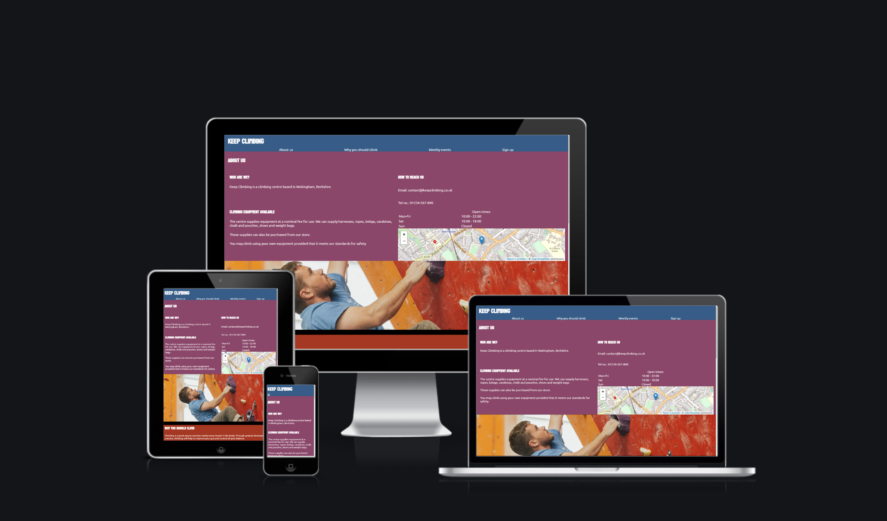

# Keep Climbing

Keep Climbing is a wall climbing centre, based in Wokingham, Berkshire.

## Contents
---
- [Strategy](#strategy)
  - [Target Audience](#target-audience)
  - [Site Aims](#site-aims)
- [Scope](#scope)
- [Structure](#structure)
  - [Welcome Page](#welcome-page)
  - [Sign Up Page](#sign-up-page)
  - [News & Blog Posts](#news--blog-posts)
  - [Café & Restaurant Page](#café--restaurant-page)
- [Credits](#credits)
---

## Planning

### Strategy

#### Target Audience

* People who are interested in personal fitness
* Experienced wall and rock climbers
* Parents and children looking for an activity or planning an event

#### Site Aims

* Give the user a clear understanding of the site's purpose
* Give the impression of a professional site
* Convince the user that wall climbing is an enjoyable activity
* Show the user that Keep Climbing is a great place to go wall climbing

### Scope

* A description of the centre
* What climbing apparatus is available
* Section on the health benefits of climbing
* Weekly events
* Sign up
* Social media links

### Structure

#### Welcome Page

* Title, navigation
* Desciption of the centre
  * Why you should climb
  * Climbing equipment available
  * Weekly events
* Location on map, social media, opening times & contact

#### Sign Up Page

* Form for sign up to the centre

#### News & Blog Posts

* Articles on recent developments at the centre

#### Café & Restaurant Page

* Overview of the food & drinks available at the centre

### Skeleton

### Surface

## Features

### Title Bar & Navigation

### 'About Us' Section

## Credits

### Content

- __OpenStreetMap__

  The iframe of the map is provided by OpenStreetMap,
  and is under copyright of OpenStreetMap contributors.
  It is provided by the license found [here](https://www.openstreetmap.org/copyright).

- __Font Awesome__

  The site makes use of free icons from Font Awesome.
  The icons are available under an [open licence](https://fontawesome.com/license/free),
  and all copyright is attributable to Fonticons, Inc.

- __Unsplash__

  I have used Unsplash as a source of free stock images.
  Their license can be found [here](https://unsplash.com/license).

  _Photos used:_
  - [man wall climbing on red wall photo](https://unsplash.com/photos/G2QYE9czCEw)
    by [Roya Ann Miller](https://unsplash.com/@royaannmiller)

- __Google Fonts__

  I am using fonts provided by Google Fonts.

  _Fonts used:_
  - Koulen, [license](https://scripts.sil.org/cms/scripts/page.php?site_id=nrsi&id=OFL)
  - Ubuntu, [license](https://ubuntu.com/legal/font-licence)

- __W3Schools__

  I made use of the first example dropdown menu written in CSS from [here](https://www.w3schools.com/css/css_dropdowns.asp)
