# Keep Climbing

Keep Climbing is a wall climbing centre, based in Wokingham, Berkshire.

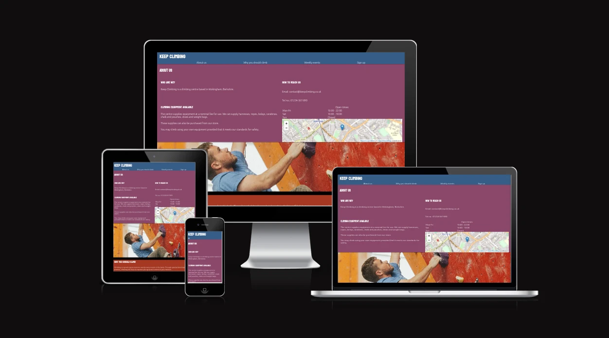

## Contents
---
- [Strategy](#strategy)
  - [Target Audience](#target-audience)
  - [Site Aims](#site-aims)
- [Scope](#scope)
- [Structure](#structure)
  - [Header](#header)
  - [About Us](#about-us)
  - [Centre Image](#centre-image)
  - [Why You Should Climb](#why-you-should-climb)
  - [Weekly Events](#weekly-events)
  - [Sign Up Form](#sign-up-form)
  - [Footer](#footer)
- [Testing](#testing)
  - [W3C HTML Validator](#w3c-html-validator)
  - [Jigsaw CSS Validator](#jigsaw-css-validator)
  - [Lighthouse](#lighthouse)
- [Deployment](#deployment)
- [Credits](#credits)
---

## Strategy

The purpose of the site is to act as a landing page for the *fictional* business of **Keep Climbing**.
This serves to inform potential customers of the climbing centre's location and goings on through the week, as well as giving them an overview of some of the reasons they may choose to climb with **Keep Climbing** and allows them to sign up.

### Target Audience

* People who are interested in personal fitness
* Experienced wall and rock climbers
* Parents and children looking for an activity or planning an event

### Site Aims

* Give the user a clear understanding of the site's purpose
* Give the impression of a professional site
* Convince the user that wall climbing is an enjoyable activity
* Show the user that Keep Climbing is a great place to go wall climbing

## Scope

* A description of the centre
* What climbing apparatus is available
* Section on the health benefits of climbing
* Weekly events
* Sign up
* Social media links

## Structure

### Header

The header serves to confirm to the view of the site that they have ended up at the correct site, and it allows them to navigate the site by jumping to whichever section they wish to.

When the viewport is wider than 767px, all the navigation links are rendered next to each other horizontally.

For viewports narrower than 768px, the navigation links disappear and a hamburger icon is rendered on the left-hand side.

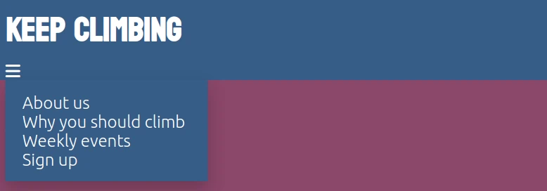

When the hamburger icon is selected, a menu containing the navigation links appears beneath the icon and on top of the page.

### About Us

The `about us` section provides some information to the site viewer on what climbing equipment is available to them through **Keep Climbing**.

For a real-life business, this section would contain information about the origins and history of the business.

The section also provides the viewer with contact information, the opening times of the centre throughout the week, and where the centre can be found.

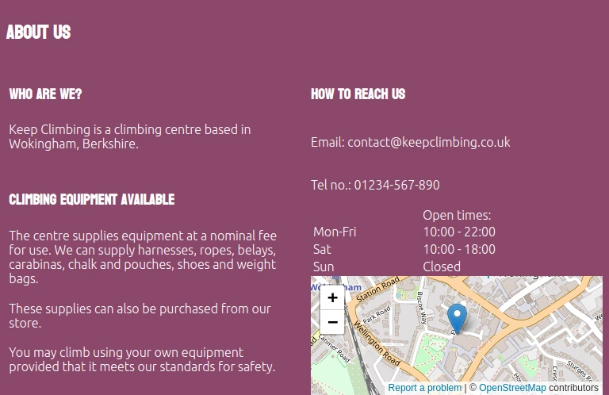

When the viewport is wider than 767px, the 'about us' section is broken into two vertical blocks, with the contact information for the site in the right column.

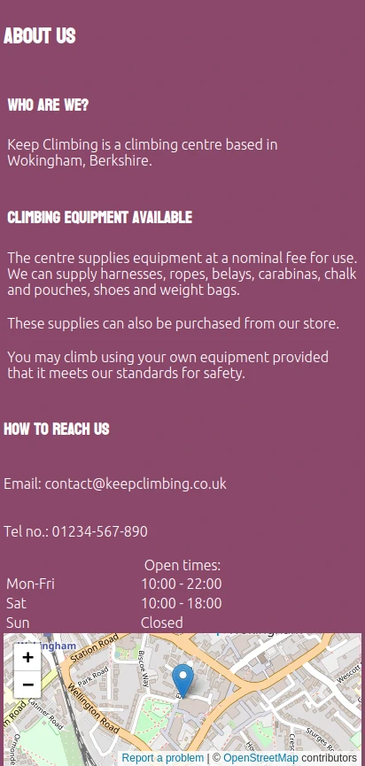

When the viewport has a width narrower than 768px, the about us section is rendered in a line, vertically.

### Centre Image

The centre image serves to provide a break for the view from the text, as well as provide a bit more visual interest to the site.

It also gives the viewer a small insight into the potential appearance of the centre *(if this was a real-life centre)*.

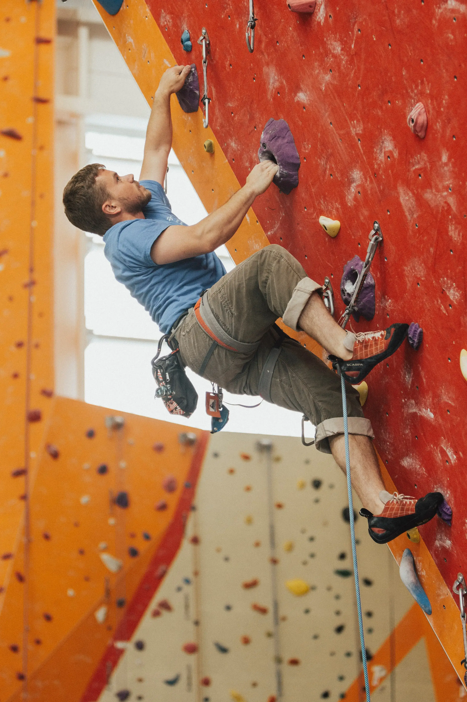

This is the full size of the image which I've used to divide the centre of the page, separating the top content of the 'about us' and 'header' sections.

The CSS I've used causes the top and bottom of the image to contract as the viewport gets narrower, but the left and right sides of the image stay fixed to the left and right sides of the element within which it is contained within.

Here's the image when rendered on a viewport width of 768px:

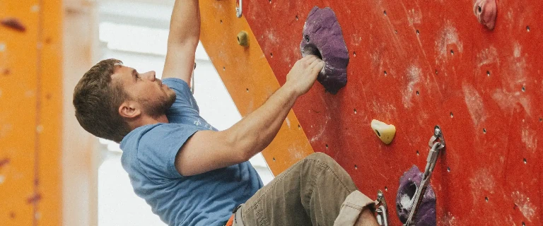

and here is the image when rendered on a viewport width of 412px:

### Why You Should Climb

This section aims to convince a viewer of the potential benefits of joining a climbing centre.

The arrangement of the section does not change with the width of the viewport.

The text wraps around the element, causing the text to fit within the viewport for practically all widths of screen size.

Here is the section on a viewport width of 768px:

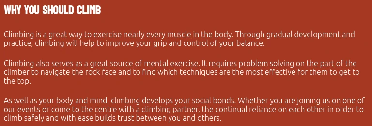

here is the section with a width of 412px:

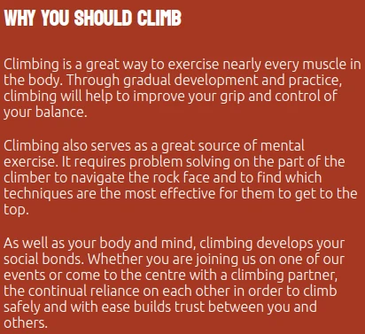

### Weekly Events

The `Weekly Events` section gives the viewer information on what events to expect at the centre throughout the week.

The hope with this section is that it would encourage the viewer to join in with some of the events.

The arrangement of the 'Weekly Events' section does not change with the viewport width.

The text wraps within its container, which means that it always fits within the viewport's width.

Here is the section when the viewport's width is 768px:

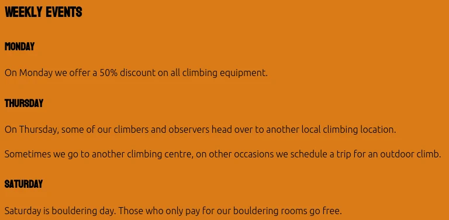

and when the width is 412px:

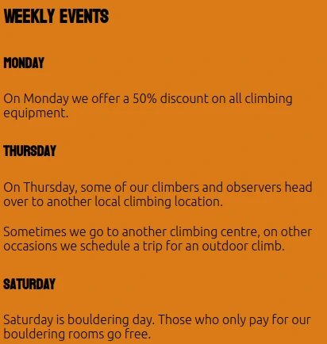

### Sign Up Form

The sign-up form allows an interested viewer to provide their details and climbing background to the company, with the idea being that they would then be contacted regarding confirming their membership and being invited to the centre for a lesson.

The 'Sign Up' form does not change its arrangement with a change in the viewport's width.

Similar to the 'Weekly Events' section, the content is guaranteed to fit within the section irrespective of the viewport's width.

Here is the section when the viewport's width is 768px:

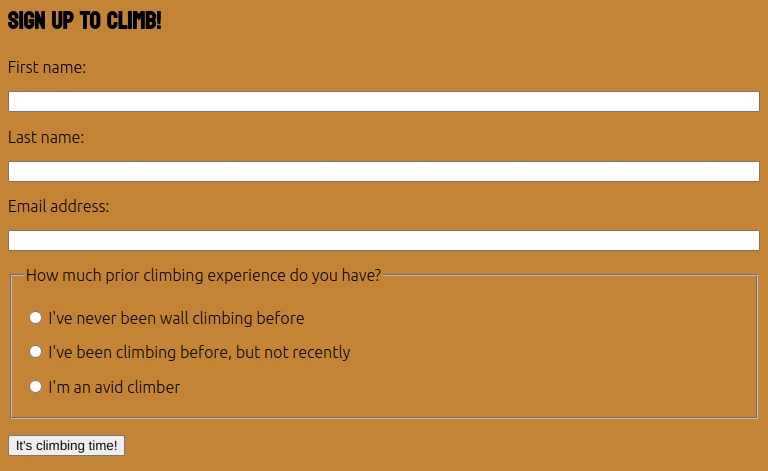

and for 412px:

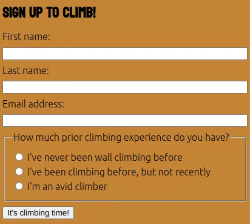

### Footer

The footer provides the user with social media links to find **Keep Climbing** through several different platforms.

It also provides a copyright mark to inform the viewer of the author and to assist in protecting the copyright of the author.

The page's footer largely keeps its arrangement the same with a varying viewport width. However, the icons for the social media links change in size.

When the width is less than 768px the icons become larger to allow them to be more visible and easier to select on small touch screen devices, like smartphones.

Here is the footer when the width is 768px:

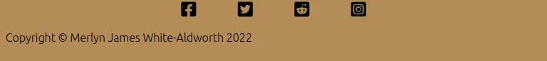

and the footer when the width is 412px:

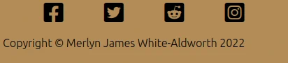

## Testing

### W3C HTML Validator

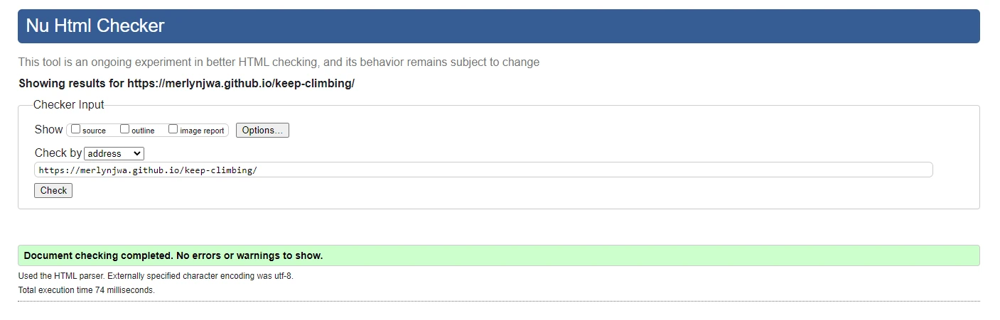

The site's HTML passes through the W3C validator without issues.

### Jigsaw CSS Validator

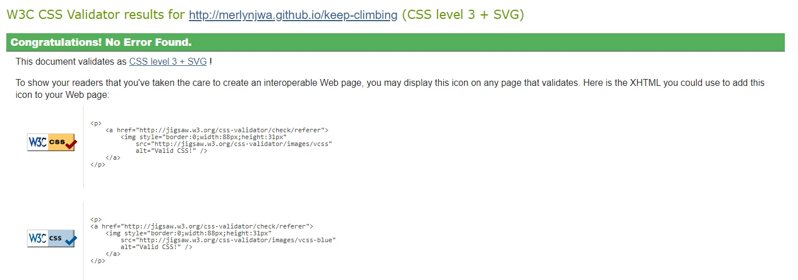

The site's CSS passes through the Jigsaw validator without issues.

### Lighthouse

The site produced the following results when I ran it on desktop mode:

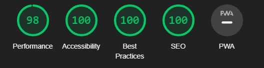

The site produced the following results when I ran it on mobile mode:

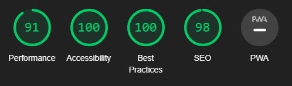

## Bugs

### Solved Bugs

I had some difficulty with keeping the centre image focused on the man climbing the wall,
keeping the left and right sides of the image fixed to the sides of the element.

I managed to resolve this issue by realising that I hadn't set the `object-fit` to `cover`
and the `object-position` to `center`.

### Unsolved Bugs

No unsolved bugs.

## Deployment

The repository has been deployed to Github Pages.

This was done through the following process:

  1. Go to the **settings** of the repository
  1. Select **pages** from the menu on the left-hand side
  1. Select the *Main* branch as the **Source** and save

The deployed site is found at this [link](https://merlynjwa.github.io/keep-climbing/)

## Credits

- __OpenStreetMap__

  The iframe of the map is provided by OpenStreetMap,
  and is under the copyright of OpenStreetMap contributors.
  It is provided by the license found [here](https://www.openstreetmap.org/copyright).

- __Font Awesome__

  The site makes use of free icons from Font Awesome.
  The icons are available under an [open licence](https://fontawesome.com/license/free),
  and all copyright is attributable to Fonticons, Inc.

- __Unsplash__

  I have used Unsplash as a source of free stock images.
  Their license can be found [here](https://unsplash.com/license).

  _Photos used:_
  - [man wall climbing on red wall photo](https://unsplash.com/photos/G2QYE9czCEw)
    by [Roya Ann Miller](https://unsplash.com/@royaannmiller)

- __Google Fonts__

  I am using fonts provided by Google Fonts.

  _Fonts used:_
  - Koulen, [license](https://scripts.sil.org/cms/scripts/page.php?site_id=nrsi&id=OFL)
  - Ubuntu, [license](https://ubuntu.com/legal/font-licence)

- __W3Schools__

  I made use of the first example dropdown menu written in CSS from [here](https://www.w3schools.com/css/css_dropdowns.asp)
